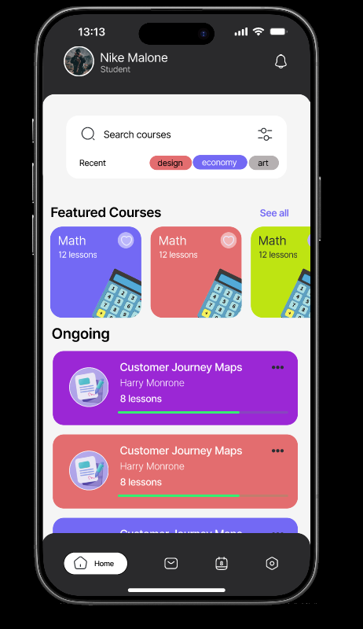
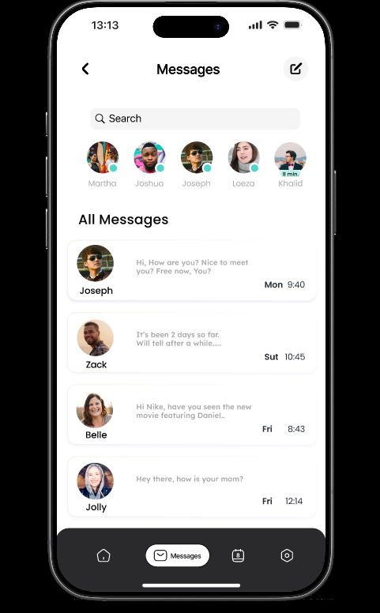

# 📱 Student Productivity App – UI/UX Design

This repository showcases a mobile application UI/UX design created in *Figma* as the final project for a UI/UX Design Bootcamp.

The application is designed to help students organize their academic activities through a clean and intuitive interface. It includes features for managing courses, tracking schedules, viewing tasks, communicating through messages, and customizing user preferences.

## Features

- User onboarding
- Home dashboard
- Course search and browsing
- Ongoing courses
- Calendar and task management
- Messaging interface
- Settings
- Language selection
- Theme customization

## Tools Used

- Figma
- Auto Layout
- Components
- Prototyping

## Project Goal

The goal of this project was to practice UI/UX design principles by creating a complete mobile application with a consistent user experience and modern interface.

## Screenshots

### Onboarding

### Home

### Calendar

### Messages

### Settings

)
